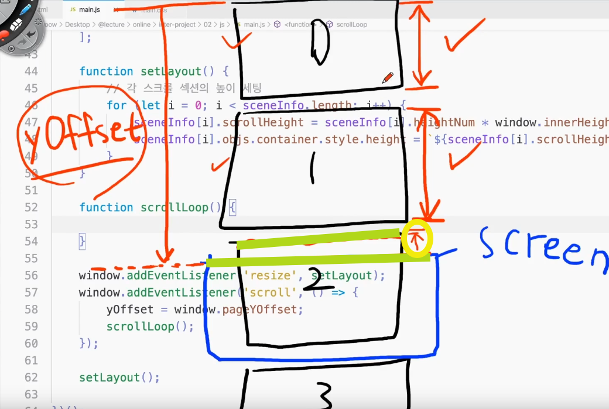

### 강의 정리 - 현재 활성시킬 씬 결정하기

<br />

이제 이 그림을 직접 구현해보자.



```
// 필요한 변수 선언
let prevScrollHeight = 0; // 현재 스크롤 위치(yOffset)보다 이전에 위치한 스크롤 섹션들의 스크롤 높이값의 합
let currentScene = 0; //현재 활성화된 씬
```

활성화 시킬 씬의 번호를 결정하는 함수를 작성하기 앞서, 우선 prevScrollHeight에 모든 씬들의 scrollheight을 모두 더해서 전체를 확인해보자.

```
function scrollLoop() {
    prevScrollHeight = 0;  // 스크롤 될 때 마다 값이 초기화
    for (let i = 0; i < sceneInfo.length; i++) {
        prevScrollHeight += sceneInfo[i].scrollHeight;
    }
    console.log(prevScrollHeight);
}
```

초기화 해줄 prevScrollHeight = 0; 를 반드시 작성해야 한다. 그렇지 않으면 모든 씬들을 더한 값들이 누적되어 제대로 된 값이 나오지 않는다.
초기화를 하면 모든 씬들의 scrollHeight 값만 계속 출력됨.

근데 지금 내가 구하고자하는 것은 현재씬임.
따라서 전체씬 모두가 아니라 이전 씬들까지만 더해주면 되는 것. i < sceneInfo.length 가 아닌 currentScene이어야 한다.

(다음에)
